# Anomaly Detection on Financial Transactions

In this project, I built a system to automatically detect fraudulent transactions in a dataset of over 6.3 million simulated mobile money transfers. The challenge was that fraud is extremely rare — only about 1 in every 800 transactions is fraudulent — so I used an "unsupervised" approach, meaning the models learned what normal transactions look like without ever being shown examples of fraud, and then flagged anything that looked unusual. I trained two different detection models (Isolation Forest and Local Outlier Factor), tuned them using Bayesian optimization, and then combined their predictions into an ensemble that achieves 96% precision — meaning that when the system flags a transaction as suspicious, it is correct 96 out of 100 times.

---

## Dataset Overview

The data comes from PaySim, a synthetic dataset that simulates real-world mobile money transactions. It contains 6,362,620 transactions across five types, with an extreme class imbalance — only 0.13% of transactions are fraudulent.

| Property | Value |
|----------|-------|
| Total Transactions | 6,362,620 |
| Fraudulent Transactions | 8,213 (0.13%) |
| Non-Fraudulent Transactions | 6,354,407 (99.87%) |
| Transaction Types | 5 (Cash Out, Payment, Cash In, Transfer, Debit) |
| Average Transaction Amount | $179,862 |
| Median Transaction Amount | $74,872 |

---

## Exploratory Data Analysis

### Class Distribution

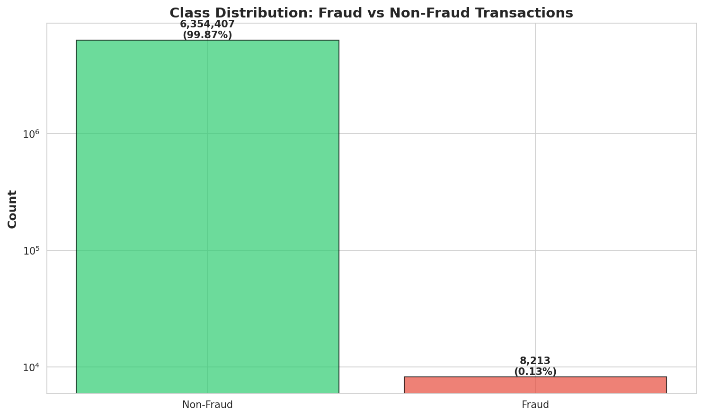

This chart shows how dramatically imbalanced the dataset is. The overwhelming majority of transactions (99.87%) are legitimate, with fraud making up just a tiny sliver (0.13%). I used a logarithmic scale here so the fraud bar is actually visible — on a regular scale it would be nearly invisible. This extreme imbalance is why I chose unsupervised methods that learn "normal" behavior rather than trying to learn from the handful of fraud examples.

### Transaction Type Distribution

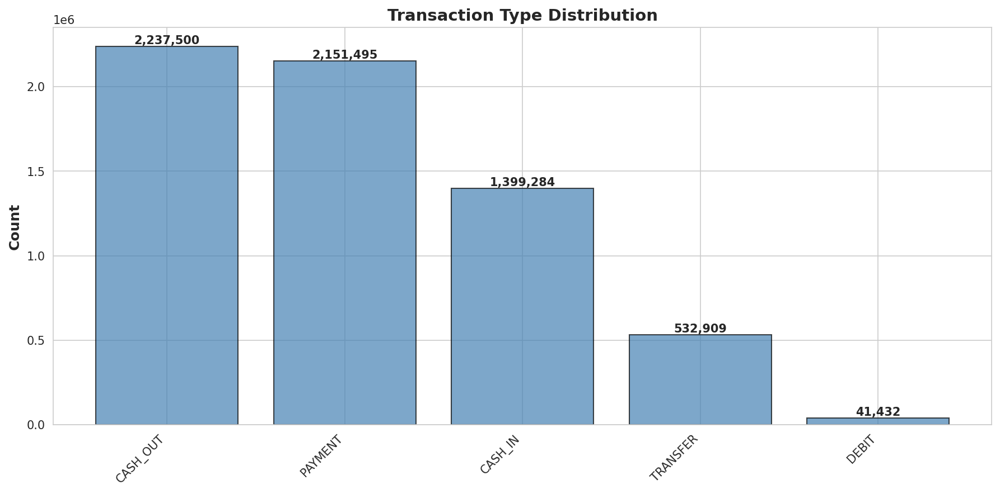

This chart breaks down how many transactions fall into each category. Cash Out and Payment are by far the most common, followed by Cash In. Transfer and Debit transactions are much less frequent. Understanding the volume of each type is important because, as I show next, fraud is concentrated in only certain types.

### Fraud by Transaction Type

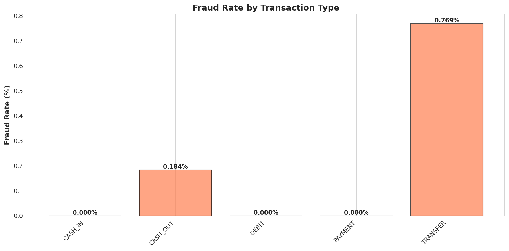

This is one of the most important findings from the exploratory analysis. Fraud occurs exclusively in Transfer and Cash Out transactions — the two types where money leaves an account. Cash In, Payment, and Debit transactions have zero fraud. This makes intuitive sense: a fraudster's goal is to move money out of a victim's account. The fraud rate for Transfers (~4.6%) is notably higher than Cash Out (~4.1%).

### Transaction Amount Distribution

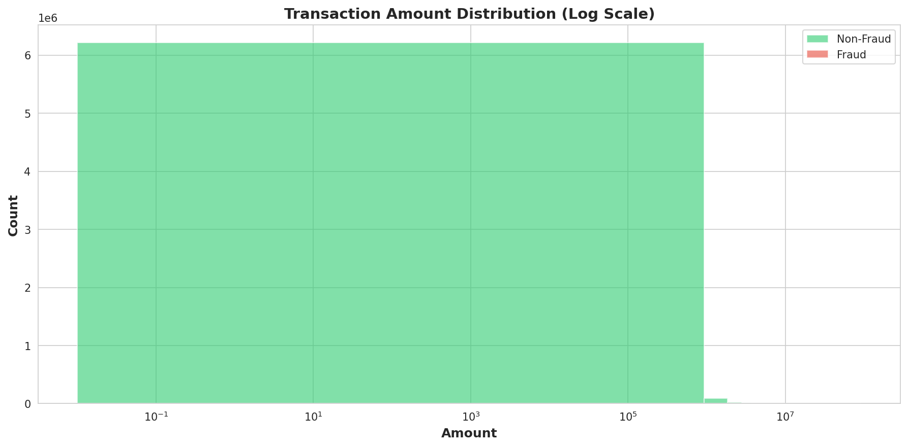

This chart compares the distribution of transaction amounts for fraudulent versus non-fraudulent transactions. Both are shown on a logarithmic scale because amounts span a huge range ($0 to $92.4 million). Fraudulent transactions tend to involve larger amounts, which makes sense — if someone is stealing money, they typically try to take as much as possible.

### Amount by Transaction Type

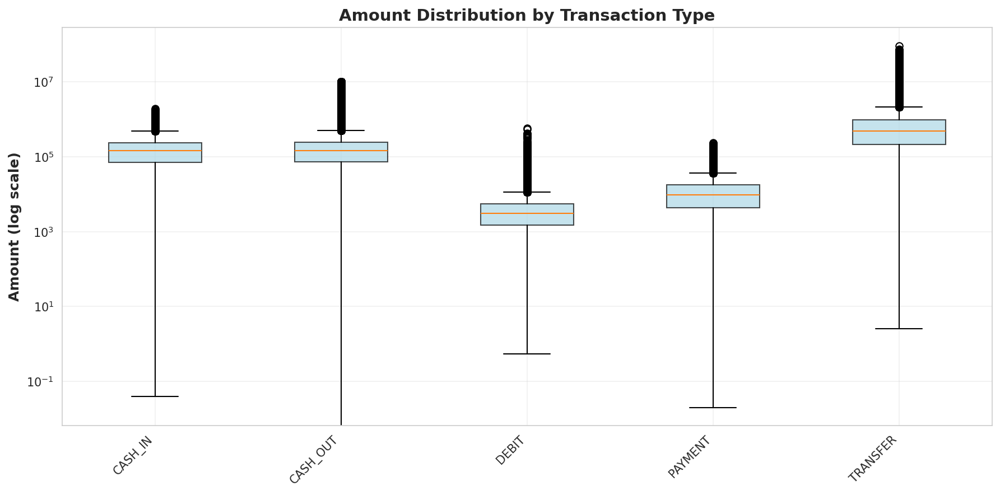

These box plots show how transaction amounts vary across the five transaction types. Each box represents the middle 50% of transactions for that type, with the line inside marking the median. Transfer and Cash Out transactions (where fraud occurs) tend to involve higher amounts compared to other types.

### Balance Analysis

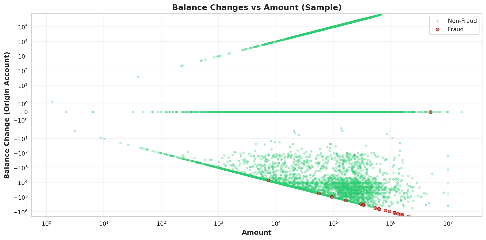

This scatter plot reveals a key fraud pattern: the relationship between transaction amount and how the sender's balance changes. Many fraudulent transactions (shown in a distinct color) result in the sender's balance being completely emptied — a strong indicator of suspicious activity. This insight directly informed the features I engineered for the models.

### Correlation Heatmap

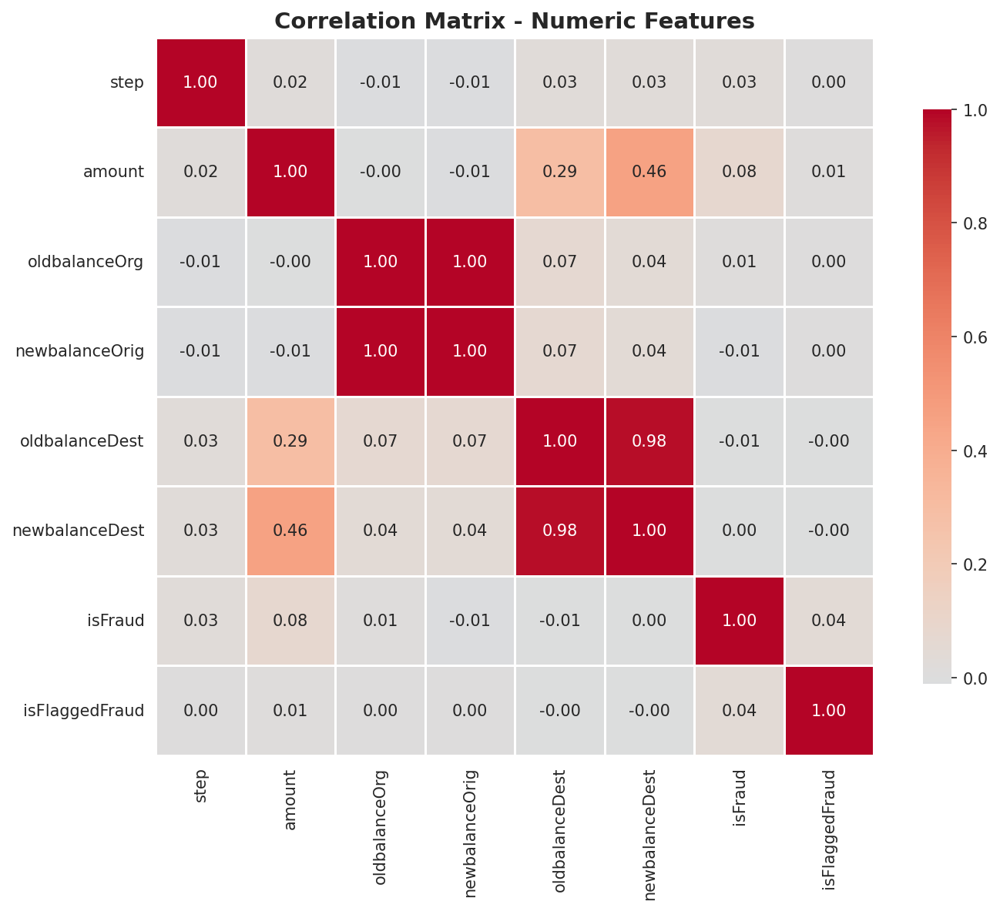

This heatmap shows how strongly each pair of numerical features is related. Darker colors indicate stronger relationships. For example, there is a strong correlation between the original balance and the new balance, which is expected. I used this analysis to understand feature relationships and guide feature engineering decisions.

### Temporal Distribution

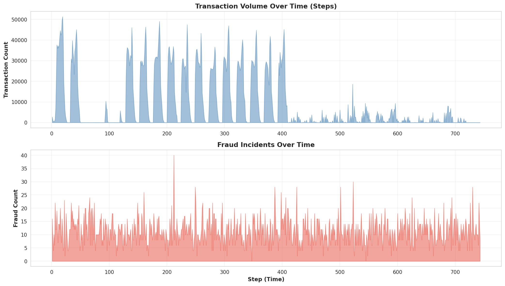

This two-panel chart shows how transaction volume and fraud incidents change over time. The top panel shows the overall flow of transactions, while the bottom panel shows when fraud occurs. Understanding these temporal patterns was important for designing the time-based data split I used to prevent data leakage during model training.

---

## Feature Engineering and Preprocessing

I transformed the raw transaction data into 10 engineered features designed to help the models distinguish normal from anomalous behavior.

| Feature | Description | Why It Matters |
|---------|-------------|----------------|
| `balance_change_orig` | How much the sender's balance changed | Large unexpected drops may indicate fraud |
| `balance_change_dest` | How much the receiver's balance changed | Unusual inflows may signal a fraud destination |
| `amount_to_balance_ratio` | Transaction amount relative to sender's balance | Draining a large percentage of an account is suspicious |
| `is_balance_zeroed` | Whether the sender's balance hit zero | Accounts being emptied is a strong fraud signal |
| `hour_of_day` | Time of day the transaction occurred | Fraud may cluster at unusual hours |
| `type_CASH_IN` | Whether the transaction was a Cash In | One-hot encoded transaction type |
| `type_CASH_OUT` | Whether the transaction was a Cash Out | One-hot encoded transaction type |
| `type_DEBIT` | Whether the transaction was a Debit | One-hot encoded transaction type |
| `type_PAYMENT` | Whether the transaction was a Payment | One-hot encoded transaction type |
| `type_TRANSFER` | Whether the transaction was a Transfer | One-hot encoded transaction type |

### Data Splitting Strategy

I split the data by time to simulate a real-world deployment where models are trained on past data and evaluated on future data:

| Split | Time Period | Transactions | Fraud Rate | Purpose |
|-------|------------|-------------|------------|---------|
| Training | First 60% of time steps | 600,593 | 0% (non-fraud only) | Models learn what "normal" looks like |
| Validation | Next 20% of time steps | 228,103 | 0.68% | Tune hyperparameters and thresholds |
| Test | Final 20% of time steps | 123,580 | 1.34% | Final unbiased evaluation |

The training set contains only non-fraudulent transactions — this is the core of the unsupervised approach. The models never see fraud during training; they learn the patterns of normal behavior and then flag anything that deviates from those patterns.

---

## Model 1: Isolation Forest

Isolation Forest works by randomly splitting data with decision trees. The key insight is that anomalies are rare and different from normal data, so they can be "isolated" in fewer splits. A normal transaction is buried deep in the data and takes many splits to separate, while a fraudulent transaction stands out and can be isolated quickly.

I used Bayesian optimization (Optuna) to tune the hyperparameters, optimizing for PR-AUC — a metric specifically designed for imbalanced datasets where the thing you are looking for is very rare.

### Anomaly Score Distribution

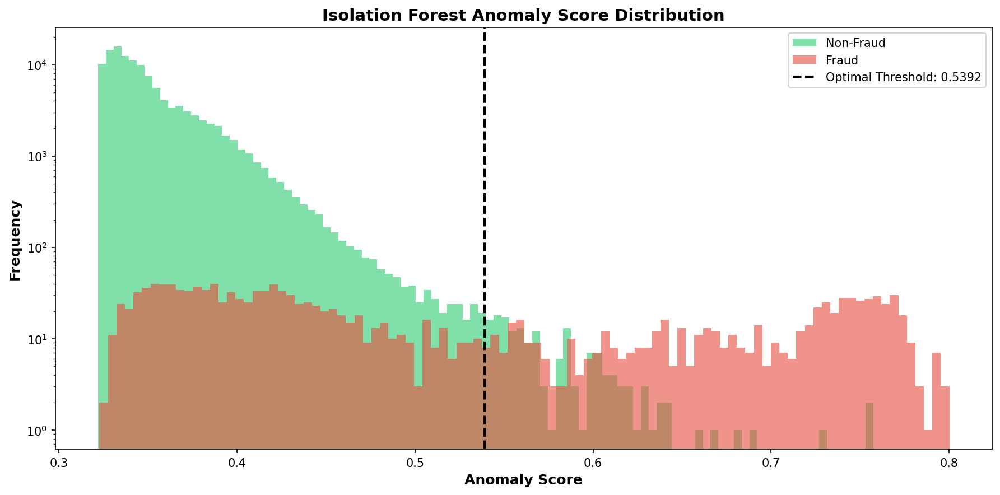

This histogram shows how the model scores each transaction. Higher scores mean "more anomalous." The dashed vertical line is the optimal threshold — transactions scoring above this line get flagged as suspicious. The key takeaway is the separation between the non-fraud scores (clustered to the left) and fraud scores (spread further to the right), indicating the model is learning meaningful patterns.

### Precision-Recall Curve

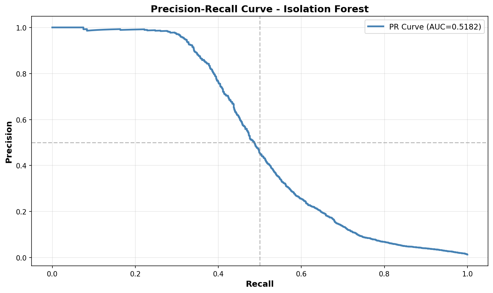

This curve shows the tradeoff between precision (when I flag something, how often am I right?) and recall (of all the fraud that exists, how much did I catch?). A perfect model would hug the top-right corner. The area under this curve (PR-AUC = 0.52) is the single best summary metric for imbalanced problems like this one.

### ROC Curve

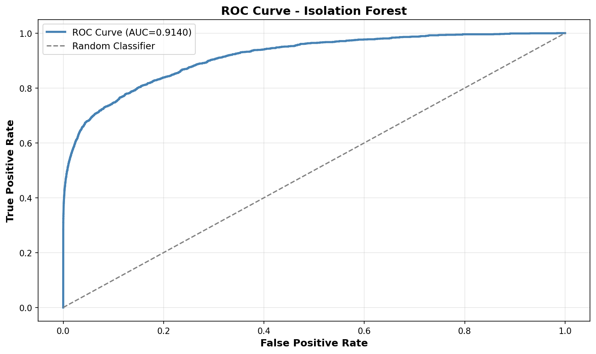

The ROC curve shows how well the model separates fraud from non-fraud across all possible thresholds. An ROC-AUC of 0.91 means the model has strong discriminating power — if I randomly picked one fraudulent and one legitimate transaction, the model would correctly rank the fraudulent one as more suspicious 91% of the time.

### Confusion Matrix

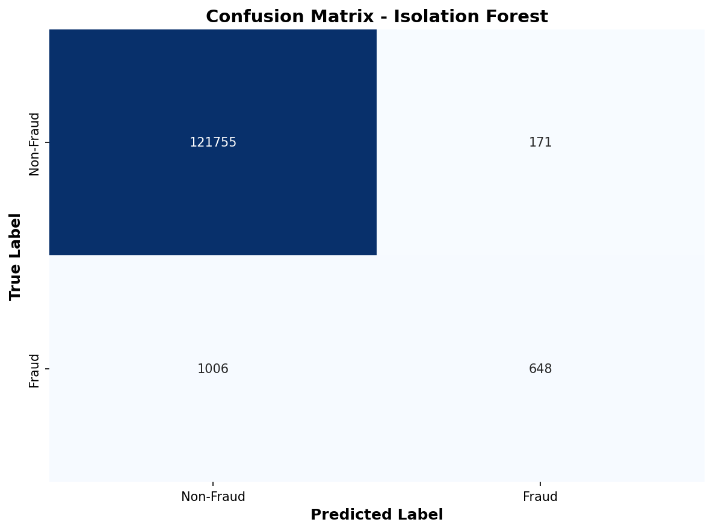

This grid shows exactly what the model got right and wrong on the test set at the optimal threshold. It breaks predictions into four categories: correctly identified fraud (true positives), correctly identified non-fraud (true negatives), legitimate transactions incorrectly flagged (false positives), and fraud that was missed (false negatives).

---

## Model 2: Local Outlier Factor (LOF)

Local Outlier Factor takes a different approach — instead of isolating points, it compares the "density" of each transaction's neighborhood to its neighbors' neighborhoods. If a transaction sits in a sparse region while its neighbors are in dense regions, it is likely an outlier. Think of it like noticing someone standing alone in a crowd — they are conspicuous because everyone around them is clustered together.

### Anomaly Score Distribution

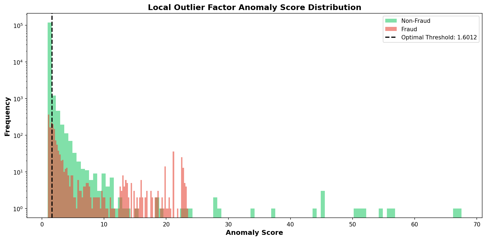

This histogram shows the LOF anomaly scores. Compared to Isolation Forest, the score distribution has more variability, which reflects the different way LOF measures anomalousness. The threshold line shows where the model draws the line between "normal" and "suspicious."

### Precision-Recall Curve

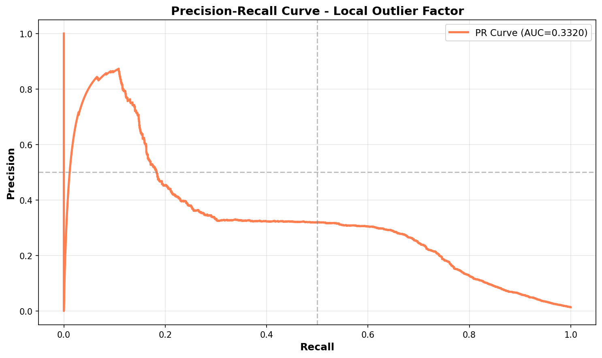

The PR curve for LOF shows a steeper decline compared to Isolation Forest, reflecting a more pronounced tradeoff between precision and recall. The PR-AUC of 0.33 is lower than Isolation Forest's 0.52, indicating that LOF struggles more with the precision-recall balance on this particular dataset.

### ROC Curve

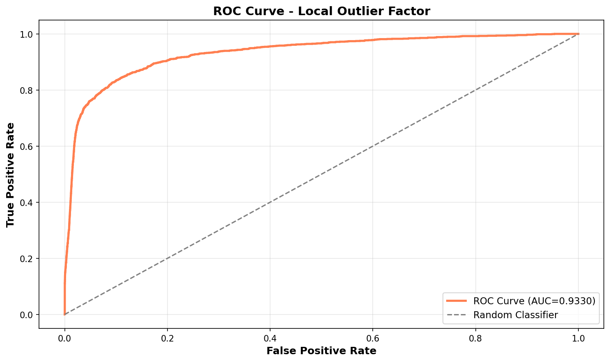

Interestingly, LOF achieves a slightly higher ROC-AUC (0.93) than Isolation Forest (0.91), meaning it has slightly better overall discrimination ability. However, ROC-AUC can be misleading for imbalanced datasets, which is why I primarily rely on PR-AUC for model selection.

### Confusion Matrix

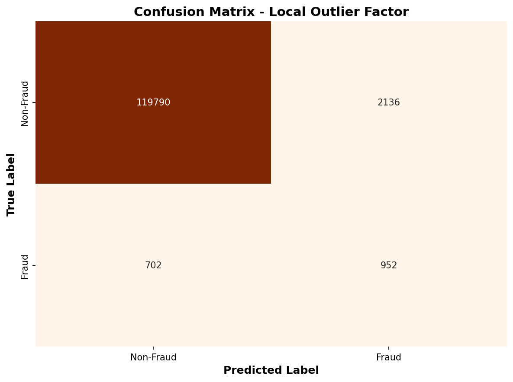

LOF's confusion matrix reveals a different error profile than Isolation Forest. LOF catches more fraud (higher recall at 58%) but generates more false alarms (lower precision at 31%). This makes it the more aggressive detector — it casts a wider net but catches more false positives in the process.

---

## Model Comparison

### ROC Curve Comparison

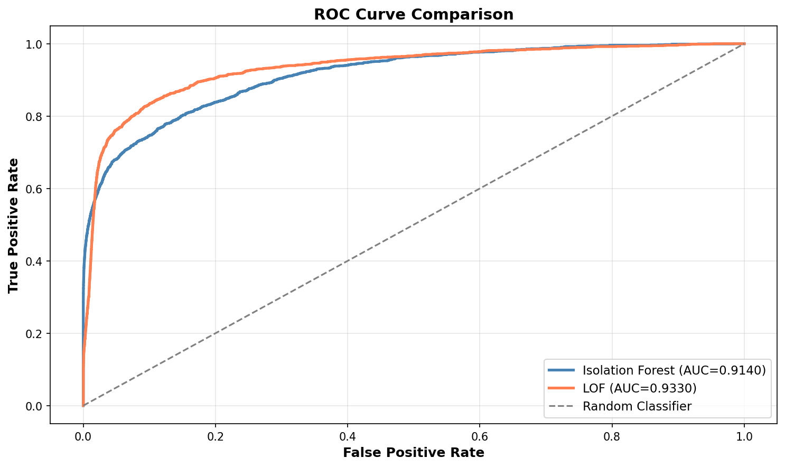

This chart overlays both models' ROC curves on the same plot. Both models perform well on this metric, with LOF having a slight edge (0.93 vs 0.91). The curves are close together, showing that both models have strong overall discrimination ability.

### Precision-Recall Curve Comparison

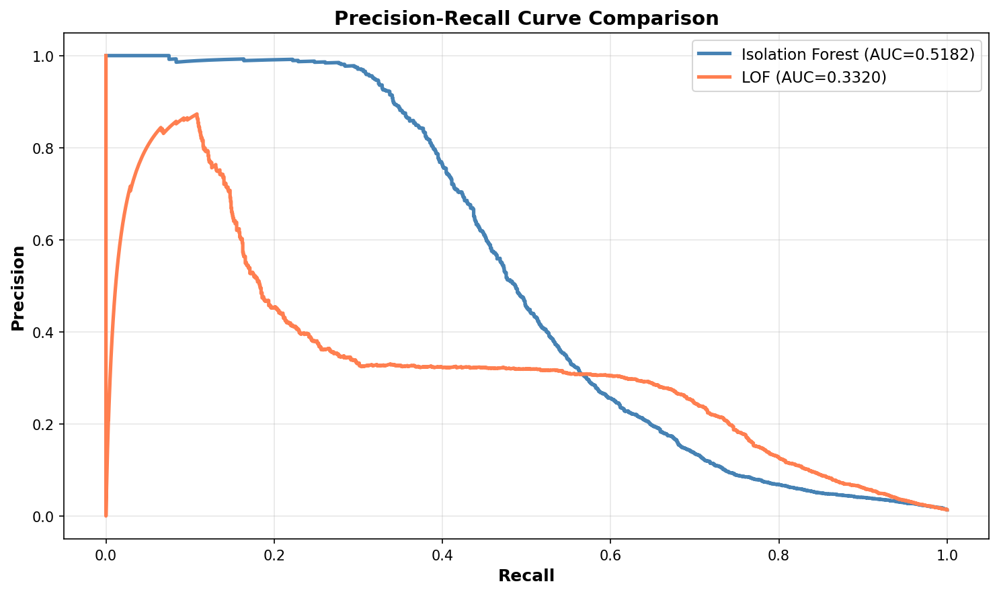

When compared on the more informative PR metric, Isolation Forest clearly outperforms LOF. This chart shows that Isolation Forest maintains higher precision across most recall levels, making it the better choice when false alarms are costly.

### Side-by-Side Metrics

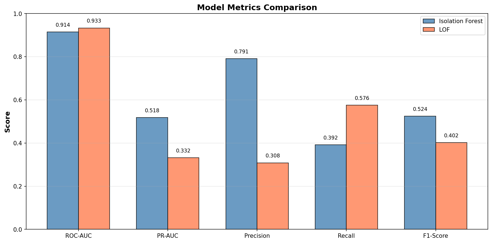

This bar chart provides a direct comparison across all five evaluation metrics. The key tradeoff is immediately visible: Isolation Forest excels at precision (79% vs 31%), while LOF excels at recall (58% vs 39%). Neither model dominates across all metrics, which motivated the ensemble approach.

| Metric | Isolation Forest | Local Outlier Factor |
|--------|-----------------|---------------------|
| ROC-AUC | 0.914 | 0.933 |
| PR-AUC | 0.518 | 0.332 |
| Precision | 79.1% | 30.8% |
| Recall | 39.2% | 57.6% |
| F1-Score | 0.524 | 0.402 |

### Score Distributions

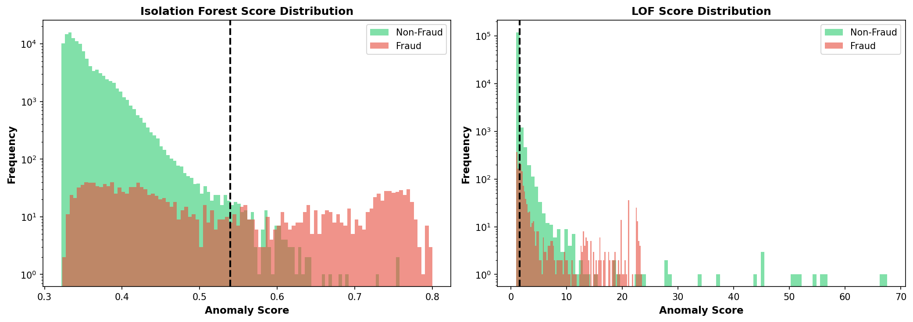

This side-by-side visualization shows how each model assigns anomaly scores to fraud and non-fraud transactions. The degree of separation between the two distributions indicates how well each model distinguishes between the two classes. Different scoring patterns reflect the fundamentally different approaches each algorithm takes to detecting anomalies.

---

## Ensemble Results

I combined both models using a consensus approach: a transaction is only flagged as fraudulent when **both** models independently agree it is suspicious. This dramatically improves precision at the cost of some recall.

| Metric | Isolation Forest | LOF | Ensemble (Both Agree) |
|--------|-----------------|-----|----------------------|
| Precision | 79.1% | 30.8% | **96.0%** |
| Recall | 39.2% | 57.6% | 33.7% |
| F1-Score | 0.524 | 0.402 | 0.499 |
| Transactions Flagged | — | — | 581 |
| True Fraud Found | — | — | 558 |
| False Alarms | — | — | 23 |

The ensemble achieves **96% precision** — when it flags a transaction, it is almost certainly fraud. Out of 123,580 test transactions, it flagged just 581 for review, of which 558 were genuine fraud and only 23 were false alarms. This makes the system highly practical for real-world deployment, where each flagged transaction requires costly manual investigation.

---

## Key Design Decisions

| Decision | Rationale |
|----------|-----------|
| Unsupervised learning | In real fraud detection, labeled examples of fraud are often unavailable when a system is first deployed. Training on "normal only" simulates this realistic constraint. |
| Temporal data split | Splitting by time (rather than randomly) prevents data leakage and simulates real deployment where models are trained on historical data and applied to future transactions. |
| PR-AUC as primary metric | With only 0.13% fraud, accuracy and ROC-AUC can be misleading. PR-AUC focuses on the rare positive class and provides a more honest evaluation. |
| Ensemble consensus | Requiring both models to agree eliminates nearly all false positives, making the system practical for high-cost review environments. |
| Bayesian hyperparameter tuning | Optuna's Bayesian optimization finds good hyperparameters more efficiently than grid search, which is important given the large dataset size. |
